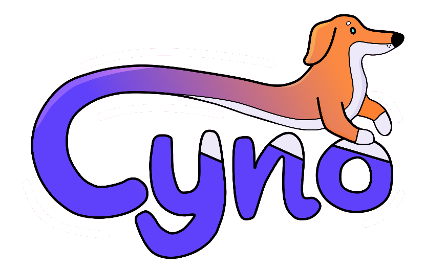

    

    <b>Cyno:</b> The bot that makes your Discord server more fun!

    <a href="#developing-cyno">Developing Cyno</a> | <a href="#setting-up-cyno-single-shard">Setting up Cyno (Single Shard)</a>

---

This repository contains the source tree for Cyno. There are 3 main parts to the Cyno source tree:

-   `bot`: The source code for the bot. The bot uses [react-djs](https://github.com/iamjsd/react-djs) to manage interactions.
-   `site`: This contains the Next app router based site that powers the dashboard at [cyno.lol](https://cyno.lol). This is designed to both be deployable on the edge at Vercel (for our managed instance) and to be able to be self-hosted for custom instances of the bot.
-   `database`: This package contains the database logic that is shared between both of these.

Husky is used to ensure code consistency on commit and run the lints within the web application. The bot is built using some custom logic built on top of ESBuild. In some situations, when you add dependencies, you may need to update `bot/build.cjs` to stop it being bundled. The bot will hot reload in development mode.

## Developing Cyno

To develop Cyno, you will need the following:

-   A Discord bot user.
-   A uploadthing project.
-   node,js 20 or higher (lower Node versions might work, but are untested).

Once you have these, you can run `npm ci` to go ahead and install all the dependencies for all of your packages and then run `npm run dev`. The first time you run this, you will get a CLI setup wizard to walk you through setting up your devlopment environment. After that (or instantly if you have walked through the setup before), foreman will then start all the required processes. You can then go to `localhost:5100` to see the dashboard or interact with the bot in Discord.

Some useful commands for development (all of these are ran in the root folder):

-   `npm run db:generate-migrations`: Generate database migrations. This should be ran when you change the schema.
-   `npm run db:migrate`: Pushes the migrations to the database. This is ran initially when you setup your development environment, but may be useful if you make any changes to the schema.
-   `npm run commands:migrate`: Runs migrations for commands on your Discord account. This is ran initially when you setup your development environment, but may be useful if you add a command.
-   `npm run bump-node`: Bumps the Node version in nvmrc and all of the Dockerfile's to the latest LTS release of Node.js.

## Setting up Cyno (Single Shard)

This is the approach you probably want to take if you just need a single Discord shard. You will need the following:

-   A Linux server to run Cyno on with Docker, Docker Compose, and Bun installed.
-   A Discord bot user.
-   A uploadthing project.

On the server, clone Cyno to the folder `/opt/cyno`, cd to the directory, and run `bun scripts/serverSetup.ts`. This script will setup your environment (if it isn't setup already) and then install/upgrade Cyno.
